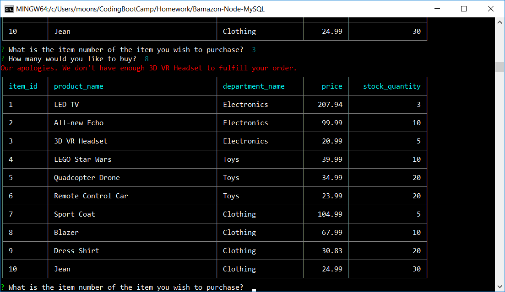

# Bamazon-Node-MySQL

## Overview

In this activity, I create an Amazon-like storefront with the MySQL skills. The app will take in orders from customers and deplete stock from the store's inventory. As a bonus task, I can program my app to track product sales across your store's departments and then provide a summary of the highest-grossing departments in the store.

## Instructions

### bamazonCustomer.js (Customer View)

1. Running this application will first display all of the items available for sale. Include the ids, names, and prices of products for sale.

2. The app should then prompt users with two messages.

   * The first should ask them the ID of the product they would like to buy.
   * The second message should ask how many units of the product they would like to buy.

3. Once the customer has placed the order, your application should check if your store has enough of the product to meet the customer's request.

   * If your store _does_ have enough of the product, you should fulfill the customer's order.   

   

   * If not, the app should log a phrase like `Insufficient quantity!`, and then prevent the order from going through.

### bamazonManager.js (Manager View)

* Running this application will:

  * List a set of menu options:

    * View Products for Sale
    
    * View Low Inventory
    
    * Add to Inventory
    
    * Add New Product

  * If a manager selects `View Products for Sale`, the app should list every available item: the item IDs, names, prices, and quantities.

  * If a manager selects `View Low Inventory`, then it should list all items with an inventory count lower than five.

  

  * If a manager selects `Add to Inventory`, your app should display a prompt that will let the manager "add more" of any item currently in the store.

  

  * If a manager selects `Add New Product`, it should allow the manager to add a completely new product to the store.

